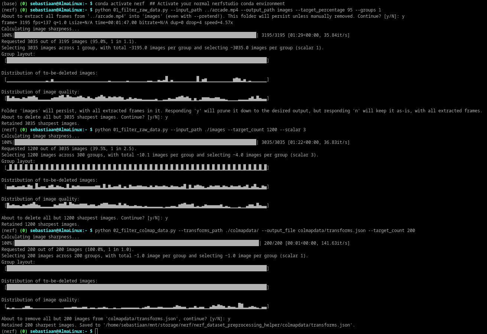

# NeRF Dataset Preprocessing Helper

This repository contains Python scripts to pre-filter frames in image datasets for use in NeRF-based workflows, particularly with Nerfstudio in mind (but should work for any raw or COLMAP workflow). The repo includes two main scripts: `01_filter_raw_data.py` and `02_filter_colmap_data.py`.  
It allows you to pre-filter your datasets on image sharpness, with a bit more control and a slightly different selection method than the Nerfstudio tools give you.  

This is particularly useful for filtering a completed COLMAP dataset down to fewer images, as most NeRF applications struggle with getting too many images from similar angles/positions, resulting in a drop in quality.
As such, you want to use as many unique angles and as little duplicate angles as possible when training a NeRF.
However, you cannot always generate a COLMAP dataset with only a few images, especially if you're, for example, using a long video as source for your dataset.

The `02_filter_colmap_data.py` script will let you filter images from your finished COLMAP dataset in a smart way, while preserving the positional data of the rest.

The scripts will also visualize the quality distribution throughout your dataset, and will visualize what would be deleted and how, so you can adjust your strategy on a per-dataset basis.

Be aware, these scripts may use a lot of memory, depending on the resolution and amount of images processed.

Inspired by https://github.com/WalterGropius/FFF_deblur.

## Features
- Sharpness selection based on Laplacian Variance.
- Pre-filter raw images or videos using `01_filter_raw_data.py`.
- Post-filter a completed COLMAP dataset using `02_filter_colmap_data.py`.
- Detailed control over the number of images and their quality.
- Visualization support for quality distribution in your dataset.
- No additional dependencies that aren't already in Nerfstudio (i.e. you can run the script in your Nerfstudio conda environment).
- Can run entirely non-interactively, but asks for confirmation by default before doing anything.
- Can operate in-place or to a separate output folder/file.



## Usage

### Pre-filtering video or image sets with `01_filter_raw_data.py`

This script is useful for filtering out less sharp frames before running them through COLMAP or similar preprocessors.  
When you run `ns-process-data video`, it already uses ffmpeg's thumbnailing functionality to attempt to pick out the best frames to use, however the best thumbnail may not also be the best frame to use in a NeRF. There's also no control.  
This script gives you a few more knobs.

### Post-filtering completed COLMAP datasets with `02_filter_colmap_data.py`

This is probably the most significant/useful script here, with likely the most impact on your overall data quality.  
This script will take any COLMAP transforms.json, iterate over the images in it, and remove images from the transforms.json based on your filtering rules.  
This can be extremely useful when you have a long format video as input, and you need full COLMAP/HLOC mapping data, but you don't want every found frame to be used by nerfstudio.  
The general consensus is that less is more with nerfstudio, you want as little images possible while still covering as many angles as possible. This is difficult to achieve with extensive scenes, as you need many more images to run COLMAP/HLOC successfully.  
This script allows you to run COLMAP on as many images as you want, preserving the camera positions for every frame, and then trims down the resulting transforms.json to only include the sharpest images, optionally distributed evenly.  
Do note however, this script only modifies transforms.json. It does not touch the images, nor the db file. If your software does not rely on transforms.json, this tool may not work for you.

**Basic Syntax:**
#### 01_filter_raw_data.py:

```
usage: 01_filter_raw_data.py [-h] --input_path INPUT_PATH
                             [--output_path OUTPUT_PATH] [--exts EXTS]
                             (--target_count TARGET_COUNT | --target_percentage TARGET_PERCENTAGE)
                             [--groups GROUPS | --scalar SCALAR] [--pretend]
                             [--yes]

Select and retain only the sharpest frames from a video or folder of images.

options:
  -h, --help            show this help message and exit
  --input_path INPUT_PATH
                        Path to the input_path video or folder of images.
  --output_path OUTPUT_PATH
                        Directory to save the preserved images. Mandatory for
                        video, optional for images. Will delete images in-
                        place if not specified.
  --exts EXTS           If --input_path is a dir, image extensions to check
                        for. Default is 'jpg,jpeg,png'. Anything supported by
                        OpenCV should work.
  --target_count TARGET_COUNT
                        Target number of images to retain.
  --target_percentage TARGET_PERCENTAGE
                        Target percentage of top quality images to retain.
                        I.e. --target_percentage 95 removes the 5% worst
                        quality images.
  --groups GROUPS       Specify the number of groups to divide the images
                        into.
  --scalar SCALAR       Specify the scalar value to determine group division
                        if groups is not provided.
  --pretend             Pretend mode. Do not delete anything, just show what
                        would have been deleted. Warning: Will still create
                        and populate the output dir if input_path is a video!
  --yes, -y             Automatically answer 'yes' to all prompts and execute
                        actions.
```

#### 02_filter_colmap_data.py:

```
usage: 02_filter_colmap_data.py [-h] --transforms_path TRANSFORMS_PATH
                                (--target_count TARGET_COUNT | --target_percentage TARGET_PERCENTAGE)
                                [--output_file OUTPUT_FILE]
                                [--groups GROUPS | --scalar SCALAR]
                                [--pretend] [--yes]

Select and retain only the sharpest images from a COLMAP output.

options:
  -h, --help            show this help message and exit
  --transforms_path TRANSFORMS_PATH
                        Path to the main COLMAP output directory or the
                        transforms.json file.
  --target_count TARGET_COUNT
                        Target number of images to retain.
  --target_percentage TARGET_PERCENTAGE
                        Target percentage of top quality images to retain.
                        I.e. --target_percentage 95 removes the 5% worst
                        quality images.
  --output_file OUTPUT_FILE
                        Path to save the output JSON. If not specified, the
                        default is transforms_filtered.json in the same
                        directory as the transforms file.
  --groups GROUPS       Specify the number of groups to divide the images
                        into.
  --scalar SCALAR       Specify the scalar value to determine group division
                        if groups is not provided.
  --pretend             Pretend mode. Do not write or delete anything, just
                        show what would have been done.
  --yes, -y             Automatically answer 'yes' to all prompts and execute
                        actions.
```

**Example Usage:**

Pre-filter the worst 5% of images from an input video over the whole dataset, then trim it down to 1200 frames in total, run COLMAP over it, then finally trim the COLMAP dataset down to just 200 frames left.

1. **Step 1:** Filter out the worst 5% of images across the entire dataset (`--groups 1`).
    ```bash
    python 01_filter_raw_data.py --input_path ./some/video.mp4 --output_path ./images --target_percentage 95 --groups 1
    ```
    This (`--groups 1`) does not force any even distribution of removals, and if there's a big blurry section in your input data, it will remove a lot of frames there and not many elsewhere. This is why we're only removing the worst 5% this way.

2. **Step 2:** Trim down the dataset to 1200 images. Size the groups so that 4 images are taken per group to meet the quota (`--scalar 3`, exponential multiplier)
    ```bash
    python 01_filter_raw_data.py --input_path ./images --target_count 1200 --scalar 3
    ```

3. **Step 3:** After having run COLMAP (not covered here), trim it down to a more NeRF-friendly amount while preserving the camera positions.
    ```bash
    python 02_filter_colmap_data.py --transforms_path ./some/colmap/dataset/transforms.json --target_count 200
    ```

Afterwards you'll have a transforms_filtered.json in the same folder as your main transforms. Once you're happy with it, you can either replace your original transforms.json (keeping in mind that if you mess up, you have to re-do the entire COLMAP), or copy the whole COLMAP output folder and replacing the transforms.json in there with the new one.  
Then simply use that folder as your ns-train input.


## Explanation about `--groups` and `--scalar`

(This section is pretty difficult to explain effectively, if you're having trouble figuring these out, you will probably be fine just copying the example commands' settings here.)

The `--groups` and `--scalar` options control how images are selected for removal or retention, aiming to avoid large data gaps. By default, the script distributes the images it removes as evenly as possible across the dataset. This mechanism ensures that there are no significant gaps in the filtered data, preserving data consistency.

### `--groups` Option

The `--groups` option partitions your dataset into a specified number of evenly distributed groups. The script then determines how many images to retain from each group based on the `--target_count` or `--target_percentage` setting.

For instance:
- With 100 images, `--groups 2`, and requesting 10 images, the dataset will be divided into two equal halves. Five images will be retained from each group.
- With 100 images, `--groups 1`, and requesting 10 images, the entire dataset is considered as one large group. The 10 sharpest images are retained from the whole set.

### `--scalar` Option

The `--scalar` option offers a more dynamic grouping mechanism. It determines the number of groups based on the provided scalar value and the requested number of images. The grouping frequency changes with different scalar values:
- `--scalar 1` (default): For every image you wish to retain, there is a unique group. So if you request 10 images from a dataset of 100, the script divides the data into 10 groups, retaining the sharpest image from each group.
- `--scalar 2`: The dataset is divided into half the number of groups compared to `--scalar 1`, and two images are retained from each group.
- `--scalar 3`: The dataset is divided into a fourth of the groups compared to `--scalar 1` (More accurately, half those of --scalar 2), retaining four images from each group, and so forth.

Essentially, a higher scalar value means fewer but larger groups, ensuring a wider image selection base. In contrast, a lower scalar value means more but smaller groups, ensuring a tighter and more even image distribution.
